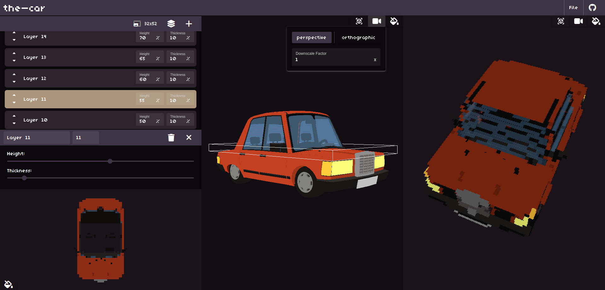

# Spracker

<b>Use it right now at [spracker.com]('https://spracker.com')!</b>

Spracker is a tool that generates sprite stacks from 3D models. Creating sprite-stacked assets can be a time consuming task. Spracker aims to streamline the process by providing a quick way to convert your existing 3D assets!

Spracker is NOT an image editing tool. Stacks will often require some manual adjustment to achieve perfection! Think of it as a starting point for your creative process.

Spracker is open source and completely free to use! It is licensed under the GPLv3 license, which means you can use it in your personal and commercial projects as long as you adhere to the terms of the license.

# Local Development

Spracker is built on TypeScript, Vite, Vue.js, and Three.js!

### Requirements

- Node.js v22+
- PNPM (`npm i -g pnpm`)

### Install

1. `pnpm i`

### Running locally

1. `pnpm dev`

# Deployment

Spracker is set up to be deployed as a static site to AWS. [sst.dev](https://sst.dev/) is being utilized to perform deployments. Two scripts are included in the package.json to manage deploys:

- `pnpm sst:deploy` - Deploys the static site with a stage of "prod" to the configured AWS environment
- `pnpm sst:remove` - Removes the "prod" stack from the AWS environment
